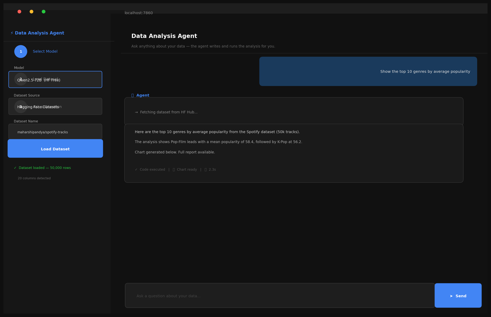
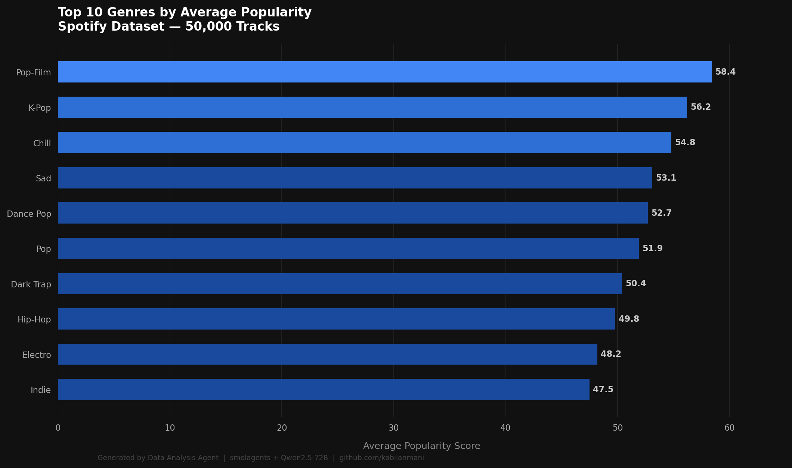
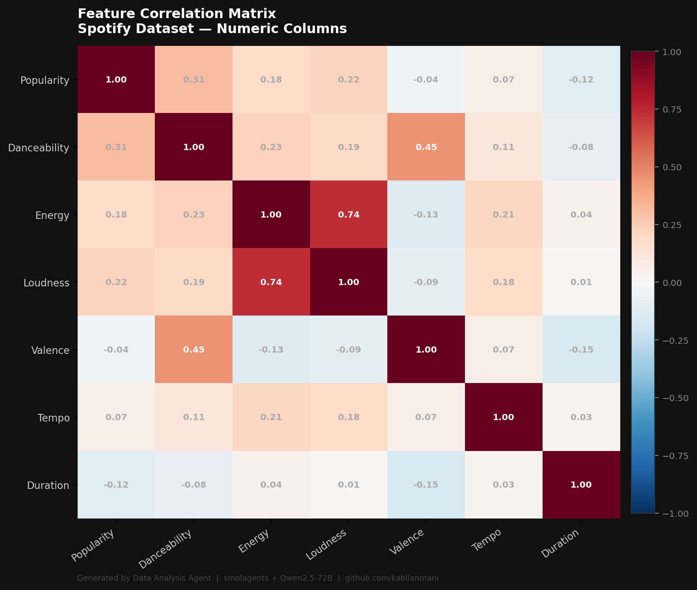

# Data Analysis Agent

[](https://github.com/KabilanM03/data-analysis-agent/actions/workflows/ci.yml)
[](https://www.python.org/)
[](LICENSE)

A small conversational agent that answers questions about real-world data (Hugging Face Datasets, Kaggle, or your own CSV) in plain English. Built while working through the [Hugging Face AI Agents Course](https://huggingface.co/learn/agents-course/) (Units 1-3) using `smolagents` and Gradio.



See [NOTES.md](NOTES.md) for the build journal: why smolagents over LangChain, the state-management refactor, what I'd do differently next time.

## What it does

You ask a question, the agent picks a dataset, loads it, runs the analysis, and answers with numbers and (when useful) a chart.

```
"Load the Spotify dataset and show the top 10 genres by popularity"
"Search Kaggle for football datasets"
"Show correlation between all numeric columns"
"Generate a full analysis report"
```

| | |
|---|---|
|  |  |

## Architecture

```
user query
   |
   v
CodeAgent (smolagents)            runs LLM-generated Python against the tools
   |                              LLM: HF Inference (Qwen) / Anthropic Claude / local Ollama
   |-- load_hf_dataset            Hugging Face Datasets Hub (shortcuts + arbitrary IDs)
   |-- fetch_kaggle_dataset       Kaggle API
   |-- load_dataset               local CSV
   |-- describe_dataset
   |-- filter_data
   |-- aggregate_data
   |-- correlation_analysis
   |-- create_visualization       matplotlib + seaborn, returns a [CHART:...] sentinel
   `-- generate_report            markdown summary
```

Per-user state lives in a `Session` dataclass bound to a `ContextVar` for the duration of each `agent.run()` call, so two browser tabs hitting the same Python process don't clobber each other's dataframe.

## Stack

| Layer | Choice |
|---|---|
| Agent framework | `smolagents` (Hugging Face) |
| LLM (default) | `Qwen2.5-72B-Instruct` via HF Inference API |
| LLM (optional) | Claude Sonnet via LiteLLM, or local Ollama |
| Data | pandas |
| Charts | matplotlib + seaborn |
| UI | Gradio |
| Python | 3.10+ |

## Run it locally

```bash
git clone https://github.com/KabilanM03/data-analysis-agent.git
cd data-analysis-agent
python -m venv .venv && source .venv/bin/activate
pip install -r requirements.txt
python app.py
```

Open `http://localhost:7860`. Paste your HF token, optionally your Kaggle credentials, then ask a question.

### Authentication

- **HF token**: free at <https://huggingface.co/settings/tokens>. Make sure Inference API access is enabled.
- **Kaggle**: token from <https://www.kaggle.com/settings/account>, then either paste username + key in the UI or drop `kaggle.json` into `~/.kaggle/`.
- **Anthropic**: only needed if you want Claude instead of Qwen.

### Built-in HF shortcuts

| Shortcut | Dataset |
|---|---|
| `spotify` | `maharshipandya/spotify-tracks-dataset` |
| `titanic` | `mstz/titanic` |
| `netflix` | `hugginglearners/netflix-shows` |
| `sales` | `Thewillonline/sales_data_sample` |
| `data jobs` | `lukebarousse/data_jobs` |
| `airbnb` | `gradio/NYC-Airbnb-Open-Data` |

You can also pass any HF dataset id like `username/dataset-name`.

## Project layout

```
data-analysis-agent/
  app.py               Gradio UI + session wiring
  agent.py             CodeAgent build + model selection
  tools/
    _state.py          per-session DataframeStore + ContextVar
    data_tools.py      load / describe / filter / aggregate / correlate
    fetch_tools.py     HF and Kaggle fetchers
    viz_tools.py       chart rendering
    report_tools.py    markdown report
  tests/               unit + mocked tests
  evals/               golden-question fixture + runner
  plots/               generated PNGs (gitignored)
  data/sample_sales.csv
  requirements.txt
```

## Tests

```bash
pytest -q
```

Network-dependent tools (HF, Kaggle) are mocked. End-to-end golden questions live in `evals/golden.yaml` and require live credentials:

```bash
python -m evals.run_evals
```

## Known limitations

- `CodeAgent` executes LLM-generated Python in-process. There is no sandbox; do not point it at production data or expose it as a public service.
- The agent and dataframe state are per-Python-process. Gradio sessions are isolated via `ContextVar`, but the model client itself is shared, so rate limits apply at the process level.
- Charts are PNGs on disk surfaced via Gradio's `allowed_paths`. Fine for local Gradio, awkward for fully headless deployments.

## Course context

Units 1-3 of the Hugging Face AI Agents Course covered:

- the Think -> Act -> Observe loop and tool design
- writing `@tool` functions in `smolagents`
- composing tools into a multi-step agent

This is the Unit 3 capstone, extended with Kaggle support, a Gradio chat UI, mocked tool tests, and a small eval harness.

## Author

**Kabilan Mani** -- MSc Data Science & AI, Queen Mary University of London (2024, Merit).

[LinkedIn](https://www.linkedin.com/in/kabilan-mani) -- [GitHub](https://github.com/KabilanM03) -- [Hugging Face](https://huggingface.co/Kabilanmani)

## Licence

MIT
