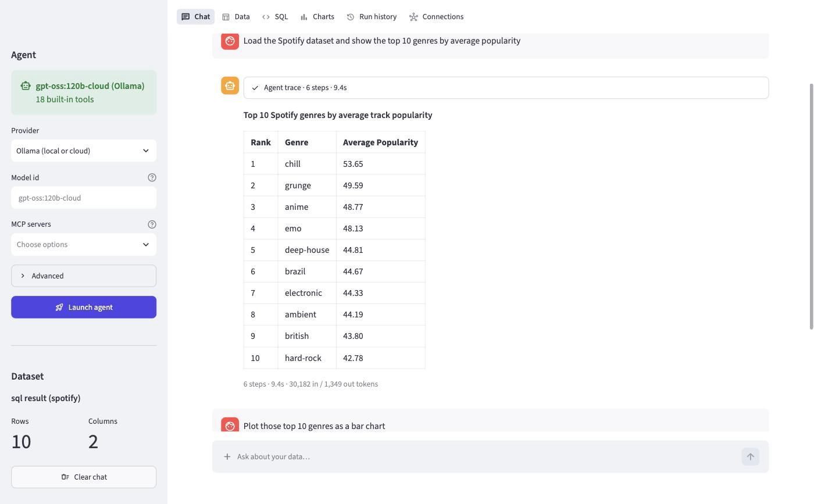
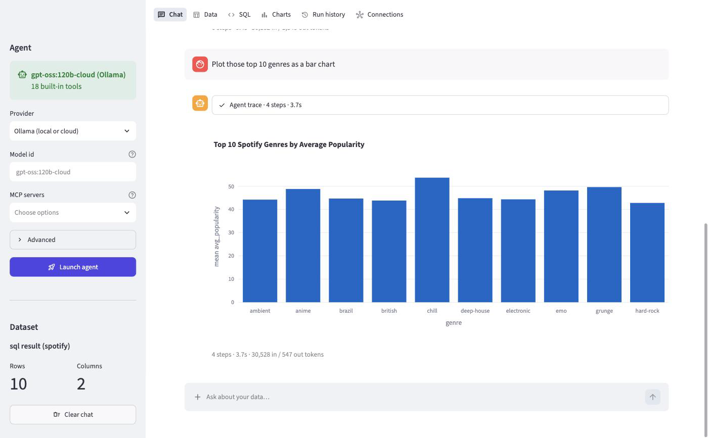
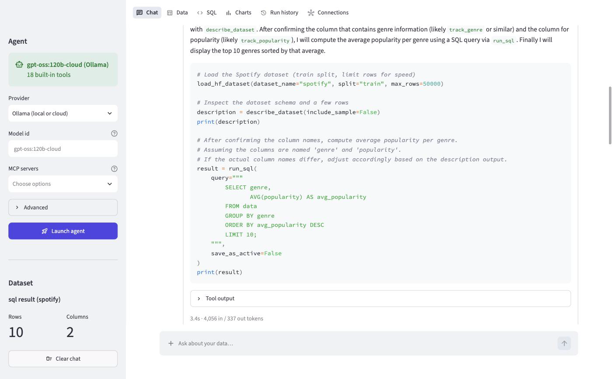

# Data Analysis Agent

[](https://github.com/KabilanM03/data-analysis-agent/actions/workflows/ci.yml)
[](https://www.python.org/)
[](LICENSE)

A conversational agent that answers questions about real data in plain English. It loads data from Hugging Face, Kaggle, your own files, cloud storage (S3, GCS, Azure, R2) or a warehouse (MotherDuck, Snowflake, BigQuery), analyses it with pandas and DuckDB SQL, and answers with numbers and interactive charts. Built on `smolagents`, started while working through the [Hugging Face AI Agents Course](https://huggingface.co/learn/agents-course/) (Units 1-3).

A real run with `gpt-oss:120b-cloud` (Ollama Cloud): the agent loaded 50,000 Spotify tracks, ranked genres with SQL, then charted them on a follow-up question. The numbers match a direct pandas check.







See [NOTES.md](NOTES.md) for the build journal and [CHANGELOG.md](CHANGELOG.md) for what changed in 2.1.

## What's in 2.1

- **Streamlit UI** with six pages: Chat (live step-by-step trace: the model's reasoning, the code it ran, tool output, time and tokens per step), Data (loaders, column profile, distributions, row selection, CSV/Parquet export), SQL (DuckDB editor with history), Charts (quick-chart builder and gallery), Run history (per-run tokens, timing, success rate, JSON export) and Connections.
- **SQL tool.** The agent can run DuckDB SQL over the loaded dataset. Queries are read-only and sandboxed: one `SELECT` per call, and file access, extension installs and `ATTACH` are switched off.
- **Cloud data.** `load_cloud_file` reads Parquet/CSV/JSON from `s3://`, `gs://`, `az://`, `r2://`, `hf://` and `https://` (globs work). `query_motherduck`, `query_snowflake` and `query_bigquery` run read-only queries; BigQuery does a dry run first and refuses scans over 1 GiB.
- **MCP client.** Any MCP server in `mcp_servers.json` (stdio or streamable HTTP) adds its tools to the agent. The example config covers MotherDuck, the BigQuery remote server, the AWS MCP Server, AWS Athena and Redshift, a Snowflake-managed server and Hugging Face.
- **MCP server.** `mcp_server.py` exposes the same tools to Claude Code, Claude Desktop or any MCP client, with charts returned as images.
- **More models.** Claude, OpenAI, Gemini (through LiteLLM), Hugging Face Inference and local Ollama, chosen in the sidebar.
- **Interactive charts.** Each chart is saved as a PNG plus a Plotly twin that the UI renders interactively.

## Architecture

```
Streamlit UI (streamlit_app.py, ui/)           MCP clients (Claude Code / Desktop)
   |  per-tab Session: store, agent, history        |
   v                                                v
CodeAgent (smolagents)  <-- MCP tools --  mcp_tools.py        mcp_server.py (FastMCP)
   |  LLM: Claude / OpenAI / Gemini via LiteLLM, HF Inference, Ollama      |
   |                                                                       |
   `-- tools/ (same functions serve both sides) ---------------------------'
        fetch_tools    Hugging Face + Kaggle
        cloud_tools    S3 / GCS / Azure / R2 / hf:// via DuckDB; MotherDuck, Snowflake, BigQuery
        data_tools     load CSV, describe, filter (persistent view), aggregate, correlate
        sql_tools      DuckDB SQL over `data` / `data_full`, read-only
        viz_tools      matplotlib PNG + Plotly JSON twin
        report_tools   markdown report
```

Each session's dataframe lives in its own `DataframeStore`. The agent gets tool copies from `bind_tools(store)` that bind that store inside every call. That matters because smolagents runs the generated code on a worker thread (for its execution timeout), and a `ContextVar` set around `agent.run()` does not reach that thread. See the 2.1 changelog.

## Run it locally

```bash
git clone https://github.com/KabilanM03/data-analysis-agent.git
cd data-analysis-agent
python3.11 -m venv .venv && source .venv/bin/activate
pip install -r requirements.txt
cp .streamlit/secrets.toml.example .streamlit/secrets.toml   # add at least one model key
streamlit run streamlit_app.py
```

Open `http://localhost:8501`, pick a model in the sidebar, press **Launch agent** and ask a question. A `.env` file works too (see `.env.example`).

Optional warehouse clients:

```bash
pip install -e ".[snowflake]"   # snowflake-connector-python
pip install -e ".[bigquery]"    # google-cloud-bigquery
```

## Deploy free on Streamlit Community Cloud

1. Push the repo to GitHub (a private repo gives you a private app on the free plan).
2. On [share.streamlit.io](https://share.streamlit.io), create an app from the repo with `streamlit_app.py` as the entry point. Community Cloud installs `requirements.txt`.
3. Paste your secrets (the contents of `secrets.toml`) into the app's **Secrets** panel.
4. For a private app, add viewers by email in the app's sharing settings. For sign-in on a public app, fill the `[auth]` block in the secrets (Google or any OIDC provider) and optionally `ALLOWED_EMAILS`.

Limits to know: apps sleep after 12 hours without traffic and have about 2.7 GB of RAM. Stdio MCP servers that launch through `uvx` need `uv` on the host, so on Community Cloud use the HTTP servers (BigQuery, Hugging Face, Snowflake-managed).

## Cloud data sources

| Source | Tool | Credentials |
|---|---|---|
| Amazon S3 | `load_cloud_file("s3://…")` | `AWS_ACCESS_KEY_ID` + `AWS_SECRET_ACCESS_KEY` (+ `AWS_REGION`), or `AWS_PROFILE` |
| Google Cloud Storage | `load_cloud_file("gs://…")` | `GCS_KEY_ID` + `GCS_SECRET` (HMAC keys) |
| Azure Blob | `load_cloud_file("az://…")` | `AZURE_STORAGE_CONNECTION_STRING` |
| Cloudflare R2 | `load_cloud_file("r2://…")` | `R2_ACCOUNT_ID` + `R2_KEY_ID` + `R2_SECRET` |
| Hugging Face files, public URLs | `load_cloud_file("hf://…" / "https://…")` | none |
| MotherDuck | `query_motherduck` | `MOTHERDUCK_TOKEN` |
| Snowflake | `query_snowflake` | `SNOWFLAKE_ACCOUNT`, `SNOWFLAKE_USER`, and `SNOWFLAKE_PRIVATE_KEY_FILE` (key-pair) or `SNOWFLAKE_PAT` |
| BigQuery | `query_bigquery` | `BIGQUERY_PROJECT` + `GOOGLE_APPLICATION_CREDENTIALS` |

Snowflake is phasing out password-only sign-in, so the connector uses key-pair auth or a programmatic access token. Give the agent a read-only role: the SQL checks here are a guard, not a permission system.

## MCP

**As a client.** Copy `mcp_servers.example.json` to `mcp_servers.json`, keep the servers you use, and pick them in the sidebar before launching. `${VAR}` placeholders are filled from the environment, so no secrets go in the file. The Connections page shows which servers are ready and can test-connect one.

**As a server.**

```bash
claude mcp add data-agent -- /abs/path/.venv/bin/python /abs/path/mcp_server.py      # stdio
python mcp_server.py --http --port 8765                                              # streamable HTTP
claude mcp add --transport http data-agent http://127.0.0.1:8765/mcp
```

`mcp` is pinned below 2.0: `mcpadapt`, which smolagents uses for MCP, does not import under the 2.x SDK yet.

## Built-in Hugging Face shortcuts

| Shortcut | Dataset |
|---|---|
| `spotify` | `maharshipandya/spotify-tracks-dataset` |
| `titanic` | `phihung/titanic` |
| `netflix` | `hugginglearners/netflix-shows` |
| `sales` | `An-j96/SuperstoreData` |
| `data jobs` | `lukebarousse/data_jobs` |
| `airbnb` | `gradio/NYC-Airbnb-Open-Data` |

Any `username/dataset-name` id works too.

## Project layout

```
data-analysis-agent/
  streamlit_app.py     entrypoint: secrets, optional sign-in, page navigation
  ui/                  sidebar, chat (live trace), data, sql, charts, history, connections
  agent.py             CodeAgent build + model providers
  mcp_tools.py         MCP client: config, env expansion, connections
  mcp_server.py        MCP server exposing the tools
  mcp_servers.example.json
  tools/
    _state.py          per-session DataframeStore, ContextVar, bind_tools
    data_tools.py      load / describe / filter / aggregate / correlate
    fetch_tools.py     Hugging Face and Kaggle
    cloud_tools.py     object storage + MotherDuck / Snowflake / BigQuery
    sql_tools.py       sandboxed DuckDB SQL
    viz_tools.py       charts (PNG + Plotly JSON)
    report_tools.py    markdown report
  tests/               unit, mocked, MCP, agent-loop and UI tests; live tests opt-in
  evals/               golden-question fixture + runner
  .streamlit/          theme config, secrets template
```

## Tests

```bash
pytest -q                          # 56 offline tests, about 2 s
RUN_LIVE=1 pytest tests/test_live.py   # hits Hugging Face: every shortcut still loads
```

The agent loop and the Streamlit app are tested offline with a scripted stand-in model (`tests/scripted_model.py`) that emits real tool-calling code, so the streaming trace, chart pickup and session isolation are covered without an API key. End-to-end questions against a real model live in `evals/golden.yaml`:

```bash
python -m evals.run_evals --provider anthropic
```

## Known limitations

- `CodeAgent` runs model-generated Python in-process with smolagents' restricted interpreter. smolagents' remote executors (E2B, Docker, Modal) would not work with this design yet, because tools hold the session's dataframe in the app process.
- Over HTTP, `mcp_server.py` keeps one active dataset per process, so every client shares it. Keep HTTP mode on localhost.
- The Snowflake-managed MCP entry authenticates with a PAT as a bearer token. That follows Snowflake's docs but I haven't tested it against a live account.

## Author

**Kabilan Mani** -- MSc Data Science & AI, Queen Mary University of London (2024, Merit).

[LinkedIn](https://www.linkedin.com/in/kabilan-mani) -- [GitHub](https://github.com/KabilanM03) -- [Hugging Face](https://huggingface.co/Kabilanmani)

## Licence

MIT
